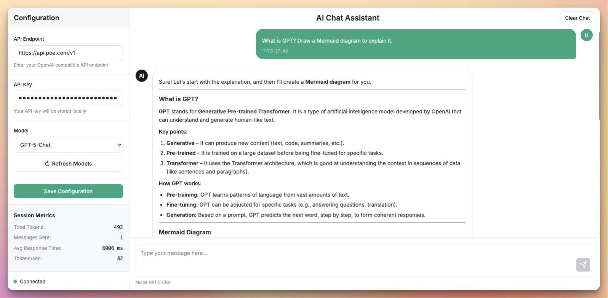
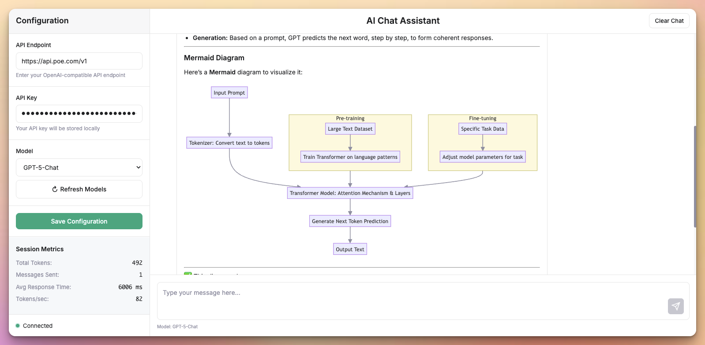

# AI Chat Interface

A simple, responsive web-based chat interface for interacting with OpenAI-compatible APIs. Built with vanilla HTML, CSS, and JavaScript.

## Live Demo

🚀 **[Try it live](https://ai-chat.vibeweb.site){:target="_blank"}**

## Screenshots

## Features

- 🎨 Clean, modern interface with responsive design
- 🔧 Configurable API endpoint and model selection
- 📊 Real-time session metrics (tokens, response time, throughput)
- 💬 Markdown rendering support with Mermaid diagrams
- 📱 Mobile-friendly sidebar navigation
- 🔐 Local storage for API configurations
- ⚡ Fast and lightweight (no build process required)

## Quick Start

1. Clone or download this repository
2. Open `index.html` in your web browser
3. Configure your API endpoint and key in the sidebar
4. Select a model and start chatting!

## Configuration

- **API Endpoint**: Set your OpenAI-compatible API URL (default: OpenAI)
- **API Key**: Your API key (stored locally in browser)
- **Model**: Choose from available models via the dropdown

## Browser Support

Works in all modern browsers that support ES6+ features.

## License

MIT License - feel free to use and modify as needed.